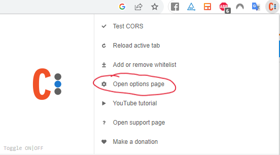
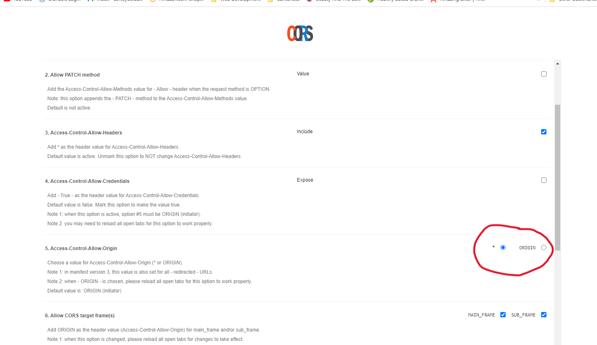

# CRAFT-DEMO

## Project setup

1. Install Node Version Manager (nvm) by running the install script from the [nvm repository](https://github.com/nvm-sh/nvm)

2. Install Node v16.9.1 using Node Version Manager (nvm): 

```
nvm install 16.9.1

```
To check you have the correct version (v16.9.1) run the following:
```
node --version

```
3. Install the latest [Vue Cli](https://cli.vuejs.org/guide/installation.html)

```
npm install -g @vue/cli

```

To check you have the correct version (v5.0.8) run the following:

```
vue --version

```
5. Within the current directory (craft-demo) run the following:

```
npm install

```

4. Navigate to the client directory and run the following:

```
npm install

```

5. Navigate to the backend directory and run the following:

```
npm install

```

6. In your browser, install a [CORS plugin](https://chrome.google.com/webstore/detail/allow-cors-access-control/lhobafahddgcelffkeicbaginigeejlf) in order for reqeusts to succeed.

**Make sure to first install CORS plugin in your browser in order for requests to succeed**

7. Click on the CORS icon and select 'Open options page.' Then set Access-Contral-Allow-Origin to '*'





## Usage

To start both the client and server simultaneously, run the following command from the craft-demo directory:

```
npm run dev
```


### Future Implementation to Consider:

- navigation guards for routes
- expand database to include users, posts and comments tables (comments mapped to posts  mapped to users via ids)
- universal (isomorphic) app (client -> node server -> backend server) if was a larger application
- infinite scroll or pagination for comment api requests if expectation is that there is a lot of data 
- delete comments
- lazy loading of images
- login/signup with user authentication
- form validation
- error handling
- finish test cases